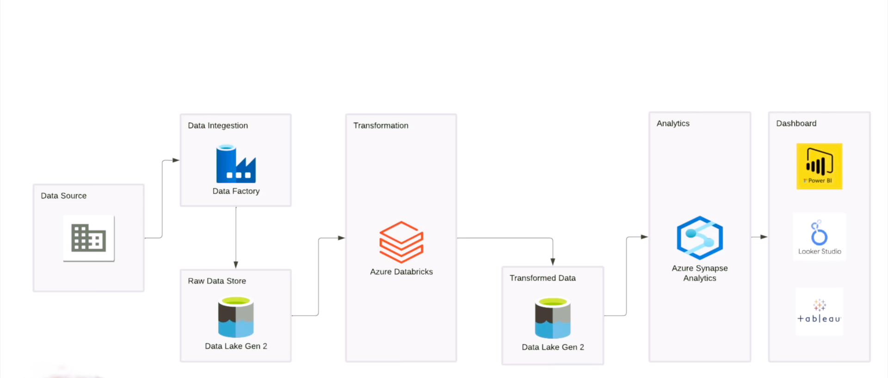

# Tokyo-Olympics-data-engineering-project : Tokyo Olympics Data handling using Azure Services

## Project Info
The "Tokyo Olympics Data Engineering Project" leverages Microsoft Azure services, including Azure Data Factory (ADF) and Azure Databricks, to efficiently manage and process large datasets from the Tokyo 2020 Olympics. By harnessing the power of cloud-based tools, the project ensures seamless data integration, transformation, and analytics, providing valuable insights for stakeholders. This approach demonstrates the capabilities of Azure in handling complex, large-scale data workflows in real-time environments.

## Architecture

## Technology Used
1. Programming Language - Python 
2. Scripting Language - SQL
3. MS Azure Cloud Services
  *  **Azure Data Factory**
  *  **Storage(ADLS Gen2)**
  *  **Azure Key Vault**
  *  **Azure Databricks**
4. Apache Spark
     
**Contribute to this Project here-** https://github.com/Amartya-Azure-DE/Tokyo-Olympics-data-engineering-project/
## Dataset Used

